# 🏫 IGT ERP – Institute Management System

A complete Institute Management System developed using **HTML5, Bootstrap 5, Custom CSS, JavaScript, Google Sheets, and Google Apps Script**.

The application helps training institutes manage student enquiries, admissions, staff records, attendance, payroll, billing, certificates, and administrative operations through a centralized dashboard.

---

# 📌 Project Overview

IGT ERP is a frontend-based ERP application designed for educational institutions and training centers.

Instead of using a traditional backend database, the project uses:

- Google Sheets as Database
- Google Apps Script as API Layer
- Fetch API for Communication
- Local Storage for Session Management

This approach makes deployment simple, cost-effective, and easy to maintain.

---

# 🎯 Main Objectives

- Manage Student Enquiries
- Register New Students
- Manage Courses
- Manage Departments
- Manage Designations
- Register Staff Members
- Track Staff Attendance
- Track Student Attendance
- Manage Payroll
- Generate Student Certificates
- Manage Student Billing
- Centralize Institute Operations

---

# 🛠️ Technology Stack

| Technology | Purpose |
|------------|----------|
| HTML5 | Structure |
| Bootstrap 5 | Responsive UI |
| Custom CSS | Styling |
| JavaScript | Business Logic |
| Fetch API | API Calls |
| Google Sheets | Database |
| Google Apps Script | Backend API |
| Font Awesome | Icons |
| Google Fonts | Typography |

---


# 📸 Screenshots

## 🔐 Sign In


## 📊 Dashboard


## 📋 Enquiry Management


## 👨‍🎓 Student Registration
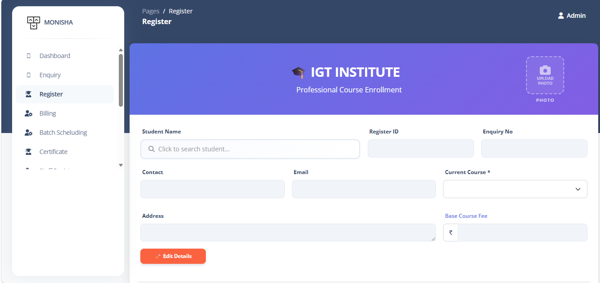


## 📚 Course Management
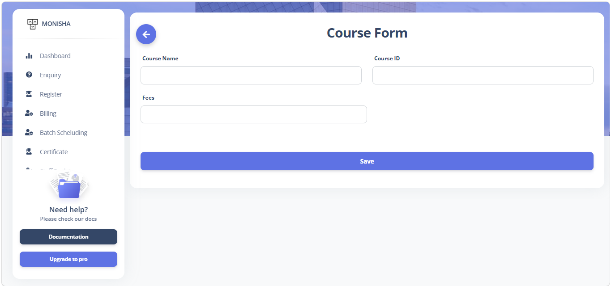
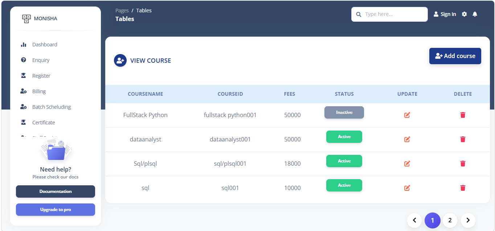

## 🏢 Department Management
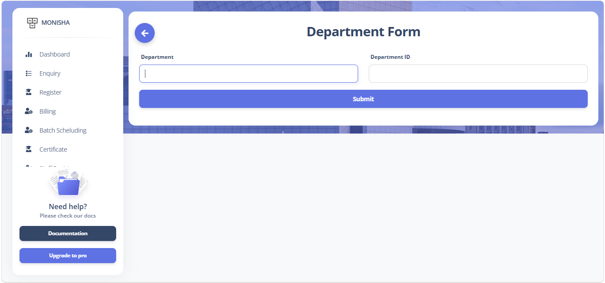
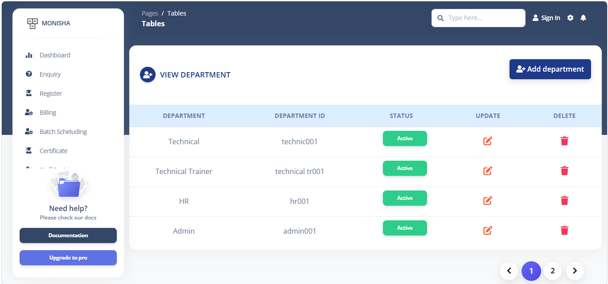

## 🪪 Designation Management
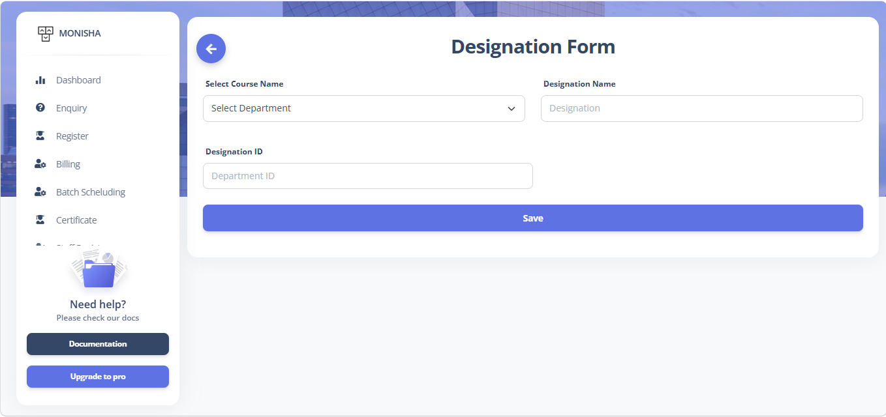
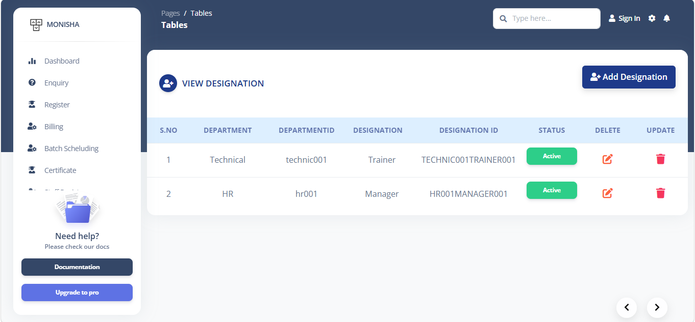

## 🧑‍🏫 Staff Registration


## 🗓️ Staff Attendance
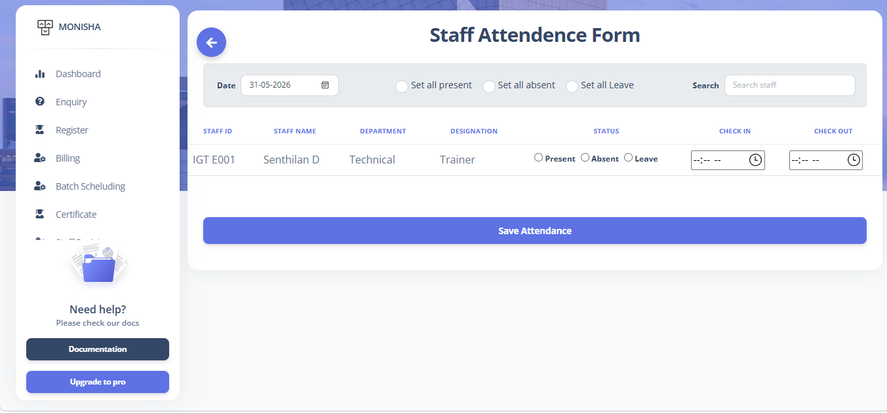
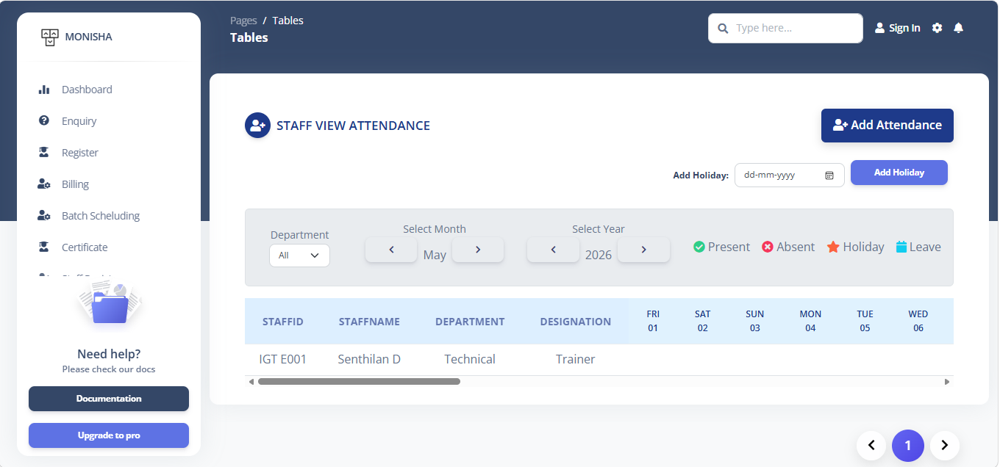

## 🏢 Batch Management


## 🎓 Student Attendance
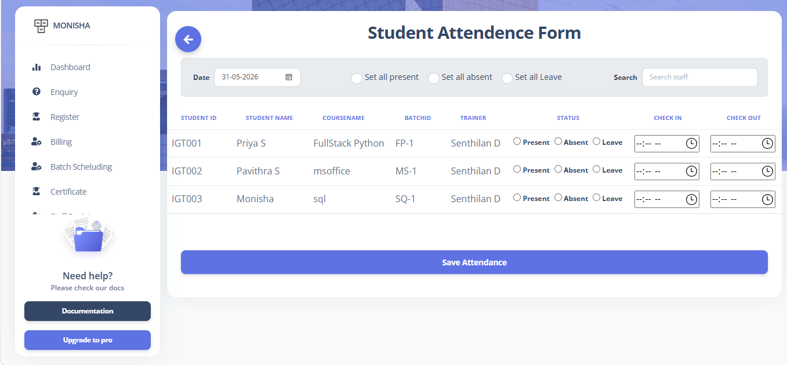
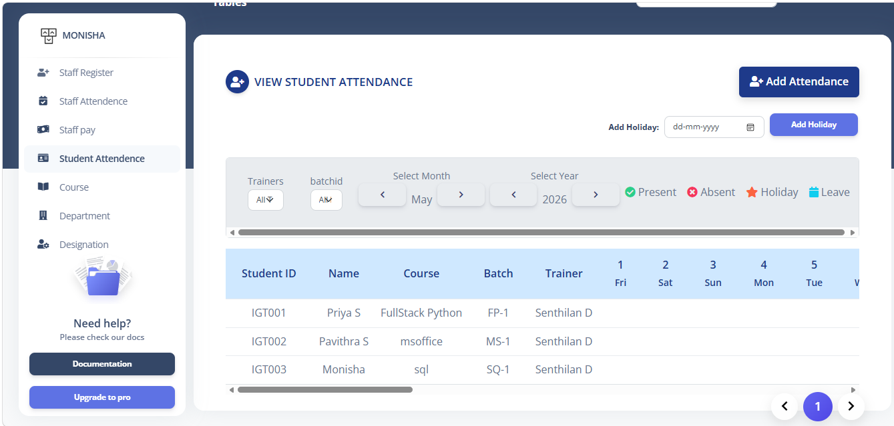

## 💰 Staff Payroll

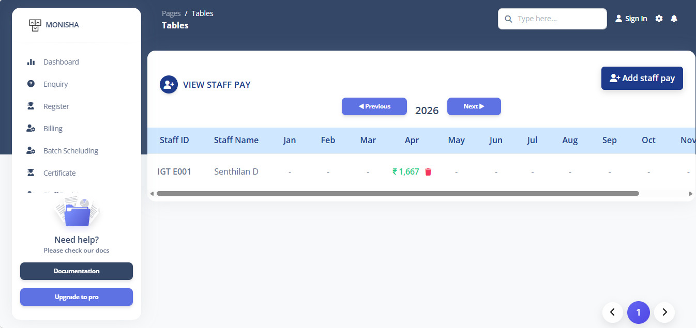

## 💳 Billing Management


## 📜 Student Certificate
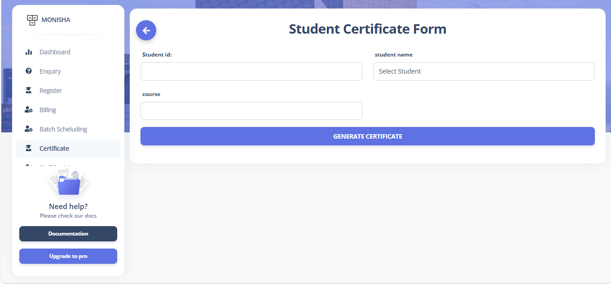
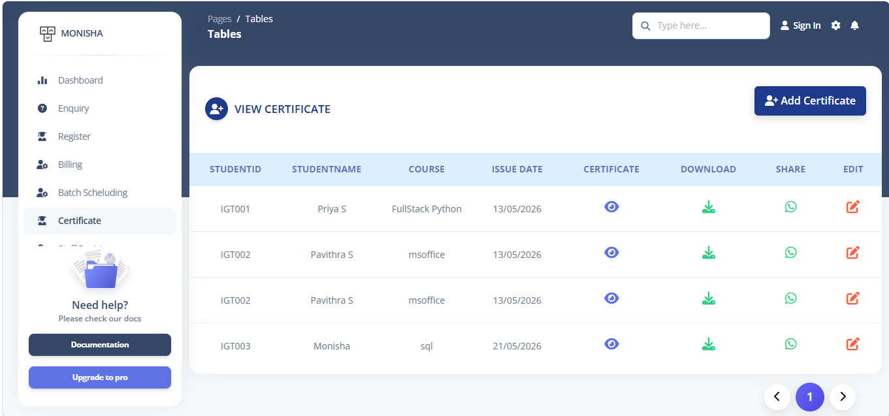


# 🔐 Module 1 – Sign In

**File:** `pages/sign-in.html`

## Purpose

Provides secure access to the ERP system.

## Features

- Username Login
- Password Login
- Password Show/Hide
- Local Storage Session
- Logout Handling
- Protected Pages

## Validation

| Field | Validation |
|---------|---------|
| Username | Required |
| Password | Required |

---

# 📊 Module 2 – Dashboard

**File:** `pages/dashboard.html`

## Purpose

Displays summary information of institute activities.

## Features

- Student Summary
- Staff Summary
- Attendance Overview
- Quick Navigation
- Institute Statistics

---

# 📋 Module 3 – Enquiry Management

**Files:**

- `pages/profile.html`
- `pages/tables.html`

## Purpose

Capture and manage student enquiries.

## Fields

| Field Name | Type |
|------------|------|
| Enquiry Date | Date |
| Student Name | Text |
| DOB | Date |
| Contact Number | Number |
| Email | Email |
| Address | Text |
| Course | Dropdown |
| Course ID | Auto Filled |
| Fees | Number |
| How Did You Know Us | Dropdown |
| 12th Marks | Number |
| 12th Year | Number |
| Diploma Marks | Number |
| Diploma Year | Number |
| UG Marks | Number |
| UG Year | Number |
| PG Details | Text |

## Functions

- Add Enquiry
- View Enquiry
- Edit Enquiry
- Store in Google Sheets

---

# 👨‍🎓 Module 4 – Student Registration

**Files:**

- `pages/Register.html`


## Purpose

Manage student admissions and records.

## Fields

| Field Name | Type |
|------------|------|
| Student ID | Auto Generated |
| Registration Date | Date |
| Student Name | Text |
| Date Of Birth | Date |
| Gender | Dropdown |
| Mobile Number | Number |
| Email | Email |
| Address | Text |
| Course | Dropdown |
| Batch | Dropdown |
| Fee Amount | Number |
| Fee Paid | Number |
| Balance Amount | Calculated |
| Status | Dropdown |

## Functions

- Student Registration
- Student Listing
- Student Management

---

# 📚 Module 5 – Course Management

**Files:**

- `pages/courseform.html`
- `pages/courseview.html`

## Fields

| Field Name | Type |
|------------|------|
| Course Name | Text |
| Course ID | Text |
| Fees | Number |

## Functions

- Add Course
- Update Course
- View Courses

---

# 🏢 Module 6 – Department Management

**Files:**

- `pages/department.html`
- `pages/departmentview.html`

## Fields

| Field Name | Type |
|------------|------|
| Department Name | Text |
| Department ID | Text |

---

# 🪪 Module 7 – Designation Management

**Files:**

- `pages/designationform.html`
- `pages/designationview.html`

## Fields

| Field Name | Type |
|------------|------|
| Department | Dropdown |
| Designation | Text |
| Department ID | Text |

---

# 🧑‍🏫 Module 8 – Staff Registration

**Files:**

- `pages/staffregister.html`
- `pages/staffregisterview.html`

## Fields

| Field Name | Type |
|------------|------|
| Employee ID | Auto Generated |
| Full Name | Text |
| Father Name | Text |
| Mother Name | Text |
| DOB | Date |
| Age | Number |
| Gender | Dropdown |
| Mobile Number | Number |
| Email | Email |
| Address | Text |
| Aadhaar Number | Number |
| Department | Dropdown |
| Designation | Dropdown |
| Qualification | Text |
| Experience | Text |
| Previous Institute | Text |
| Salary | Number |
| Date Of Joining | Date |
| Shift | Dropdown |
| Account Name | Text |
| Account Number | Number |
| IFSC Code | Text |
| Bank Name | Text |
| Aadhaar File | Upload |
| PAN File | Upload |
| Resume | Upload |
| Degree Certificate | Upload |
| Skill Certificate | Upload |

---

# 🗓️ Module 9 – Staff Attendance

**Files:**

- `pages/attendence.html`
- `pages/attendenceview.html`

## Fields

| Field Name | Type |
|------------|------|
| Attendance ID | Auto Generated |
| Date | Date |
| Employee ID | Dropdown |
| Employee Name | Auto Filled |
| Status | Present / Absent |
| In Time | Time |
| Out Time | Time |
| Remarks | Text |

---

# 🎓 Module 10 – Student Attendance

**Files:**

- `pages/studentattendence.html`
- `pages/studentattview.html`

## Fields

| Field Name | Type |
|------------|------|
| Attendance ID | Auto Generated |
| Date | Date |
| Student ID | Dropdown |
| Student Name | Auto Filled |
| Batch | Dropdown |
| Status | Present / Absent |
| Remarks | Text |

---

# 💰 Module 11 – Staff Payroll

**Files:**

- `pages/staffpayform.html`
- `pages/staffpayview.html`

## Fields

| Field Name | Type |
|------------|------|
| Payroll ID | Auto Generated |
| Employee ID | Dropdown |
| Employee Name | Auto Filled |
| Salary | Number |
| Working Days | Number |
| Present Days | Number |
| Gross Salary | Calculated |
| Deductions | Number |
| Net Salary | Calculated |
| Payment Status | Dropdown |

---

# 💳 Module 12 – Billing Management

**Files:**

- `pages/billing.html`


## Purpose

Manage student fee collection.

## Fields

| Field Name | Type |
|------------|------|
| Bill ID | Auto Generated |
| Bill Date | Date |
| Student ID | Dropdown |
| Student Name | Auto Filled |
| Course | Auto Filled |
| Total Fee | Number |
| Amount Paid | Number |
| Payment Mode | Cash / UPI / Card / Bank |
| Transaction ID | Text |
| Balance Due | Calculated |
| Receipt Number | Auto Generated |
| Notes | Text |

---

# 📜 Module 13 – Student Certificate

- `pages/studentform.html`
- `pages/studentview.html`


## Fields

| Field Name | Type |
|------------|------|
| Certificate ID | Auto Generated |
| Student ID | Dropdown |
| Student Name | Auto Filled |
| Course | Auto Filled |
| Batch | Auto Filled |
| Completion Date | Date |
| Grade / Score | Text |
| Issue Date | Date |
| Issued By | Admin |

---


# 🗄️ Database Structure

Google Sheets Tabs:

- Enquiry
- Students
- Courses
- Departments
- Designations
- Staff
- StaffAttendance
- StudentAttendance
- Payroll
- Billing
- Certificates

---

# 📁 Project Structure

```text
igterp/
│
├── pages/
│   ├── sign-in.html
│   ├── dashboard.html
│   ├── profile.html
│   ├── tables.html
│   ├── studentform.html
│   ├── studentview.html
│   ├── courseform.html
│   ├── courseview.html
│   ├── department.html
│   ├── departmentview.html
│   ├── designationform.html
│   ├── designationview.html
│   ├── staffregister.html
│   ├── staffregisterview.html
│   ├── attendence.html
│   ├── attendenceview.html
│   ├── studentattendence.html
│   ├── studentattview.html
│   ├── staffpayform.html
│   ├── staffpayview.html
│   ├── billing.html
│   ├── Register.html
│   
│
├── assets/
│   ├── css/
│   ├── js/
│   ├── img/
│   └── fonts/
│
└── docs/
    └── screenshots/
        ├── 01-sign-in.png
        ├── 02-dashboard.png
        ├── 03-enquiry-form.png
        ├── 04-enquiry-list.png
        ├── 05-student-registration.png
        ├── 06-course-form.png
        ├── 07-course-list.png
        ├── 08-department-form.png
        ├── 09-department-list.png
        ├── 10-designation-form.png
        ├── 11-designation-list.png
        ├── 12-staff-form.png
        ├── 13-staff-view.png
        ├── 14-staff-attendance-form.png
        ├── 15-staff-attendance-list.png
        ├── 16-student-attendance-form.png
        ├── 17-student-attendance-list.png
        ├── 18-payroll-form.png
        ├── 19-payroll-list.png
        ├── 20-billing-form.png
        └── 21-certificate-form.png
        └── 22-certificate-view.png


---

# 🚀 Getting Started

## Clone Repository

```bash
git clone https://github.com/Monisha71326/igterp.git
```

## Run Project

```bash
python -m http.server 8000
```

Open:

```text
http://localhost:8000/pages/sign-in.html
```

---

# 👨‍💻 Author

**Monisha D**

---

# 📞 Contact

GitHub: https://github.com/Monisha71326

LinkedIn: https://www.linkedin.com/in/monisha-d-8909a93b3

Email: iammonisha.dev@gmail.com

---

# 📄 License

MIT License
