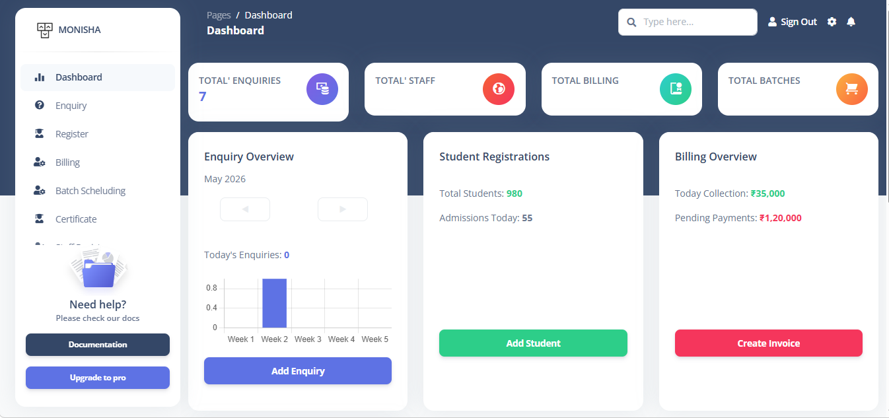
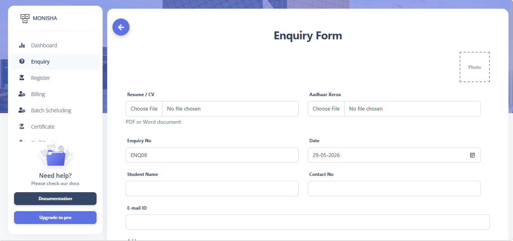
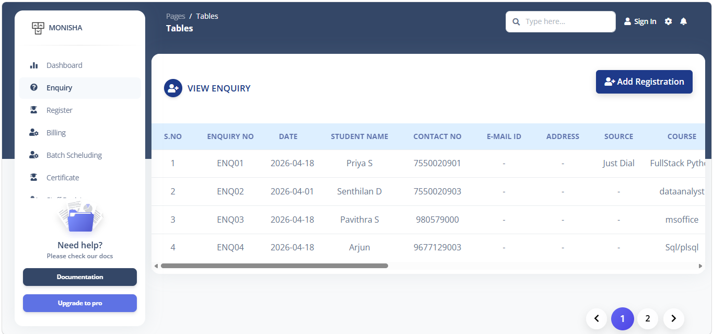
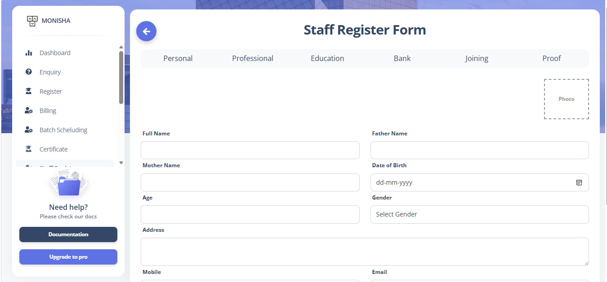
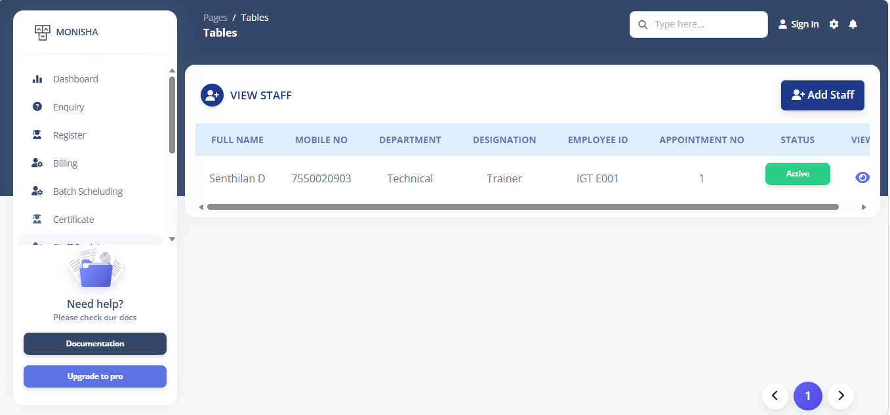
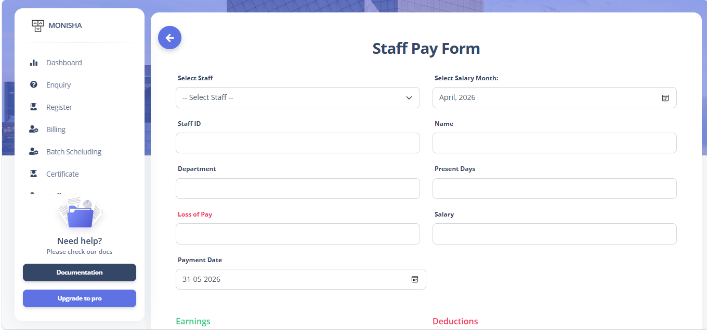
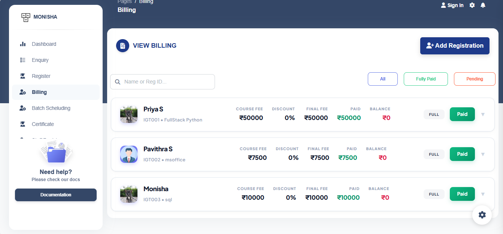
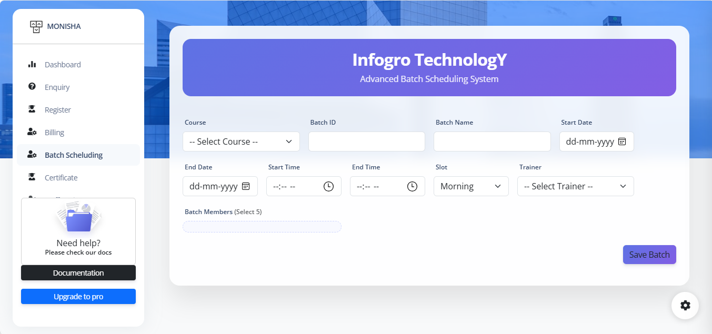
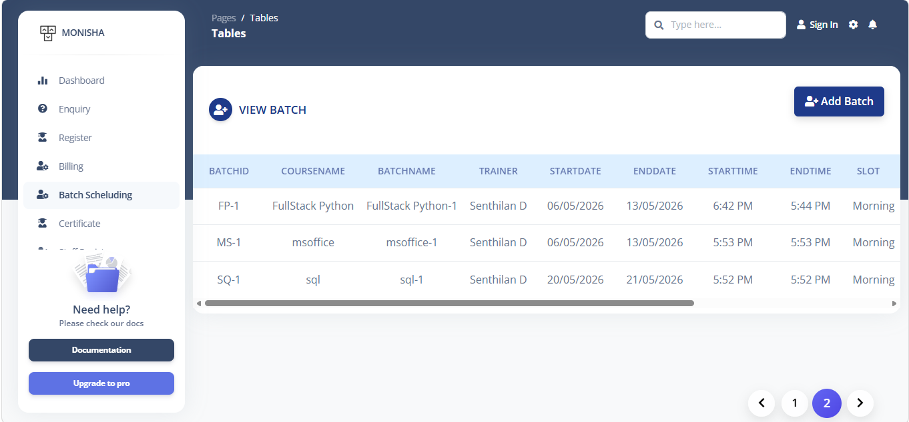

# 🏫 IGT ERP – Institute Management System

A web-based Institute ERP system built for managing all core operations of an IT training institute — using **Bootstrap 5 + Custom CSS** for UI and **plain JavaScript with fetch() API** for logic and Google Sheets integration.

---

## 📌 Project Overview

IGT ERP is a **frontend-only** admin dashboard system. All data is stored and retrieved via **Google Sheets** using **Google Apps Script Web App**.

> 🔐 Login session is managed via `localStorage` — no server required.

---

## 🛠️ Tech Stack

| Technology | Purpose |
|---|---|
| HTML5 | Page structure and markup |
| Bootstrap 5 | Responsive grid, components, layout |
| Custom CSS | Branding, colors, custom UI styles |
| JavaScript (Plain JS) | DOM manipulation, form handling, logic |
| fetch() API | Send/receive data to Google Sheets |
| Google Sheets | Backend database |
| Google Apps Script | Web App API (doGet / doPost) |
| Chart.js | Dashboard charts and analytics |
| Font Awesome | Icons throughout the UI |
| Google Fonts | Typography |

---

## 📸 Screenshots

### 🔐 Sign In Page


### 📊 Dashboard


### 📋 Enquiry Management



### 👨‍🎓 Student Registration


### 🧑‍🏫 Staff Registration



### 🗓️ Staff Attendance


### 🎓 Student Attendance


### 💰 Payroll



### 💳 Billing



### 📅 Batch Scheduling



### 📜 Certificate Generation


---

> **How to add screenshots:**
> 1. `docs/screenshots/` என்ற folder உங்கள் project-ல create பண்ணுங்க
> 2. உங்கள் pages-இன் screenshots எடுங்க
> 3. மேலே உள்ள file names-ல save பண்ணுங்க (e.g. `dashboard.png`)
> 4. Commit & push to GitHub

---

## 🗄️ Backend — Google Sheets as Database

```
Browser (HTML + Plain JS)
        ↓  fetch() POST / GET
Google Apps Script Web App (doGet / doPost)
        ↓
Google Sheets (Each module = one Sheet tab)
```

### Google Sheets Tab Structure

| Sheet Tab Name      | Module It Serves          |
|---------------------|---------------------------|
| `Enquiry`           | Enquiry Management        |
| `Students`          | Student Registration      |
| `Staff`             | Staff Registration        |
| `StaffAttendance`   | Staff Attendance          |
| `StudentAttendance` | Student Attendance        |
| `Payroll`           | Staff Payroll             |
| `Billing`           | Student Billing           |
| `Batches`           | Batch Scheduling          |
| `Certificates`      | Certificate Log           |

### Setup Steps

1. Create a new Google Sheet with the above tab names
2. Go to **Extensions → Apps Script**
3. Write `doGet()` and `doPost()` functions
4. Deploy as **Web App** → Access: **Anyone**
5. Copy the Web App URL into your project:

```javascript
// assets/js/config.js
const SHEET_API_URL = "https://script.google.com/macros/s/YOUR_SCRIPT_ID/exec";
```

### Sample fetch() API Call

```javascript
// Submit form data to Google Sheets
const formData = {
  sheet: "Students",
  action: "insert",
  payload: { name: "Ravi", course: "Python", mobile: "9876543210" }
};

fetch(SHEET_API_URL, {
  method: "POST",
  body: JSON.stringify(formData)
})
.then(res => res.json())
.then(data => {
  alert("Student registered successfully!");
})
.catch(err => {
  console.error("Error:", err);
});
```

---

## ✨ Modules — Full Detail

---

### 🔐 1. Sign In

**File:** `pages/sign-in.html`

**Purpose:** Admin authentication with localStorage session.

**Fields:**
| Field | Type | Validation |
|---|---|---|
| Username | Text input | Required, min 3 chars |
| Password | Password input | Required, min 6 chars |

**Features:**
- On login → `localStorage.setItem("loggedIn", true)`
- All pages check `loggedIn` on load; missing → redirect to sign-in
- Show/Hide password toggle (plain JS)
- Back button disabled after logout (history.pushState blocked)

---

### 📊 2. Dashboard

**File:** `pages/dashboard.html`

**Purpose:** Central overview of all institute activity.

**Summary Cards:**
| Card | Data Source |
|---|---|
| Total Enquiries | `Enquiry` sheet row count |
| Total Students | `Students` sheet row count |
| Today's Attendance | `StaffAttendance` / `StudentAttendance` |
| Pending Billing | `Billing` sheet unpaid count |

**Charts (Chart.js):**
| Chart | Type | Data |
|---|---|---|
| Enquiry Source Analysis | Pie / Doughnut | Walk-in, Online, Referral, Social Media |
| Monthly Registrations | Bar Chart | Students registered per month |
| Revenue Overview | Line Chart | Monthly billing totals |

**Features:**
- All counts fetched via fetch() on page load
- Quick navigation buttons to all modules
- Responsive Bootstrap card layout

---

### 📋 3. Enquiry Management

**Files:** `pages/enquiry.html`, `pages/enquiryview.html`

**Purpose:** Capture and track student enquiries.

**Google Sheets Columns (`Enquiry` tab):**
| Column | Field | Type | Validation |
|---|---|---|---|
| A | Enquiry ID | Auto-generated | EQ001, EQ002... |
| B | Enquiry Date | Date | Required, auto-filled today |
| C | Student Name | Text | Required, letters only |
| D | Mobile Number | Number | Required, 10 digits |
| E | Email ID | Email | Optional, valid format |
| F | Course Interest | Dropdown | Required |
| G | Enquiry Source | Dropdown | Walk-in / Online / Referral / Social Media |
| H | Status | Dropdown | New / Follow-up / Converted / Closed |
| I | Follow-up Date | Date | Optional |
| J | Notes | Textarea | Optional |

**Features:**
- Enquiry ID auto-generated on form load (JS)
- Status update from view page (inline edit via fetch POST)
- Filter by status, date range, course (JS filter on fetched data)
- Table rendered dynamically from fetch() GET response

---

### 👨‍🎓 4. Student Registration

**Files:** `pages/studentform.html`, `pages/studentview.html`

**Purpose:** Register new students and manage student records.

**Google Sheets Columns (`Students` tab):**
| Column | Field | Type | Validation |
|---|---|---|---|
| A | Student ID | Auto-generated | ST001, ST002... |
| B | Registration Date | Date | Auto-filled |
| C | Student Name | Text | Required |
| D | Date of Birth | Date | Required |
| E | Gender | Dropdown | Male / Female / Other |
| F | Mobile Number | Number | Required, 10 digits |
| G | Email ID | Email | Required |
| H | Address | Textarea | Required |
| I | Course Enrolled | Dropdown | From Courses sheet |
| J | Batch | Dropdown | From Batches sheet |
| K | Fee Amount | Number | Required |
| L | Fee Paid | Number | Required |
| M | Balance | Auto-calculated | Fee − Paid (JS) |
| N | Status | Dropdown | Active / Completed / Dropped |

---

### 🧑‍🏫 5. Staff Registration

**Files:** `pages/staffregister.html`, `pages/staffregisterview.html`

**Purpose:** Register and manage institute staff.

**Google Sheets Columns (`Staff` tab):**
| Column | Field | Type | Validation |
|---|---|---|---|
| A | Staff ID | Auto-generated | SF001, SF002... |
| B | Join Date | Date | Required |
| C | Staff Name | Text | Required |
| D | Date of Birth | Date | Required |
| E | Gender | Dropdown | Male / Female / Other |
| F | Mobile Number | Number | Required, 10 digits |
| G | Email ID | Email | Required |
| H | Department | Dropdown | Required |
| I | Designation | Dropdown | Required |
| J | Qualification | Text | Required |
| K | Salary | Number | Required |
| L | Status | Dropdown | Active / Inactive |

---

### 🗓️ 6. Staff Attendance

**Files:** `pages/attendence.html`, `pages/attendenceview.html`

**Google Sheets Columns (`StaffAttendance` tab):**
| Column | Field | Type |
|---|---|---|
| A | Attendance ID | Auto-generated |
| B | Date | Date (today auto-filled) |
| C | Staff ID | From Staff sheet |
| D | Staff Name | Auto-filled from ID |
| E | Status | Present / Absent / Half-Day / Leave |
| F | In Time | Time input |
| G | Out Time | Time input |
| H | Remarks | Text |

---

### 🎓 7. Student Attendance

**Files:** `pages/studentattendence.html`, `pages/studentattview.html`

**Google Sheets Columns (`StudentAttendance` tab):**
| Column | Field | Type |
|---|---|---|
| A | Attendance ID | Auto-generated |
| B | Date | Date (auto-filled) |
| C | Batch | Dropdown |
| D | Student ID | From Students sheet |
| E | Student Name | Auto-filled |
| F | Status | Present / Absent / Late |
| G | Remarks | Text |

---

### 💰 8. Payroll

**Files:** `pages/staffpayform.html`, `pages/staffpayview.html`

**Google Sheets Columns (`Payroll` tab):**
| Column | Field | Type |
|---|---|---|
| A | Payroll ID | Auto-generated |
| B | Month & Year | Month picker |
| C | Staff ID | Dropdown |
| D | Staff Name | Auto-filled |
| E | Basic Salary | Auto-filled from Staff sheet |
| F | Working Days | Number |
| G | Present Days | Number |
| H | Gross Salary | Auto-calculated (JS) |
| I | PF Deduction | Number |
| J | Other Deductions | Number |
| K | Net Salary | Auto-calculated (JS) |
| L | Payment Mode | Cash / Bank Transfer / UPI |
| M | Payment Status | Paid / Pending |

---

### 💳 9. Billing

**Files:** `pages/billing.html`, `pages/billingview.html`

**Google Sheets Columns (`Billing` tab):**
| Column | Field | Type |
|---|---|---|
| A | Bill ID | Auto-generated |
| B | Bill Date | Date (auto-filled) |
| C | Student ID | Dropdown |
| D | Student Name | Auto-filled |
| E | Course | Auto-filled |
| F | Total Fee | Auto-filled from Students sheet |
| G | Amount Paid | Number |
| H | Payment Mode | Cash / Card / UPI / Bank Transfer |
| I | Transaction ID | Text (for card/UPI) |
| J | Balance Due | Auto-calculated (JS) |
| K | Receipt Number | Auto-generated |
| L | Notes | Text |

---

### 📅 10. Batch Scheduling

**Files:** `pages/batch.html`, `pages/batchview.html`

**Google Sheets Columns (`Batches` tab):**
| Column | Field | Type |
|---|---|---|
| A | Batch ID | Auto-generated |
| B | Batch Name | Text |
| C | Course | Dropdown |
| D | Trainer (Staff) | Dropdown from Staff sheet |
| E | Start Date | Date |
| F | End Date | Date |
| G | Timings | Text (e.g. 9AM – 11AM) |
| H | Days | Text (e.g. Mon, Wed, Fri) |
| I | Capacity | Number |
| J | Enrolled Count | Counted from Students sheet |
| K | Status | Upcoming / Ongoing / Completed |

---

### 📜 11. Student Certificate

**File:** `pages/certificate.html`

**Google Sheets Columns (`Certificates` tab):**
| Column | Field | Type |
|---|---|---|
| A | Certificate ID | Auto-generated |
| B | Issue Date | Date (auto-filled) |
| C | Student ID | Dropdown |
| D | Student Name | Auto-filled |
| E | Course | Auto-filled |
| F | Batch | Auto-filled |
| G | Completion Date | Date |
| H | Grade / Score | Text |
| I | Issued By | Admin name |

---

## 📁 Project Structure

```
igterp/
│
├── pages/
│   ├── sign-in.html
│   ├── dashboard.html
│   ├── enquiry.html / enquiryview.html
│   ├── studentform.html / studentview.html
│   ├── staffregister.html / staffregisterview.html
│   ├── attendence.html / attendenceview.html
│   ├── studentattendence.html / studentattview.html
│   ├── staffpayform.html / staffpayview.html
│   ├── billing.html / billingview.html
│   ├── batch.html / batchview.html
│   ├── certificate.html
│   └── profile.html
│
├── assets/
│   ├── css/
│   │   ├── bootstrap.min.css
│   │   └── custom.css
│   ├── js/
│   │   ├── bootstrap.bundle.js
│   │   ├── chart.min.js
│   │   ├── config.js
│   │   └── app.js
│   ├── img/
│   └── fonts/
│
└── docs/
    ├── screenshots/              ← 📸 Screenshots இங்கே save பண்ணுங்க
    │   ├── signin.png
    │   ├── dashboard.png
    │   ├── enquiry-form.png
    │   ├── enquiry-view.png
    │   ├── student-form.png
    │   ├── student-view.png
    │   ├── staff-form.png
    │   ├── staff-view.png
    │   ├── staff-attendance.png
    │   ├── staff-attendance-view.png
    │   ├── student-attendance.png
    │   ├── student-attendance-view.png
    │   ├── payroll-form.png
    │   ├── payroll-view.png
    │   ├── billing-form.png
    │   ├── billing-view.png
    │   ├── batch-form.png
    │   ├── batch-view.png
    │   └── certificate.png
    └── documentation.html
```

---

## 🚀 Getting Started

### Prerequisites
- Any modern browser (Chrome, Firefox, Edge)
- Google account (for Google Sheets)
- No server setup needed

### Steps

1. **Clone the repo**
   ```bash
   git clone https://github.com/Monisha71326/igterp.git
   cd igterp
   ```

2. **Set up Google Sheets** with all tab names listed above

3. **Deploy Apps Script Web App** and copy URL to `assets/js/config.js`

4. **Open in browser**
   ```bash
   python -m http.server 8000
   # Visit: http://localhost:8000/pages/sign-in.html
   ```

---

## 👨‍💻 Author

**Monisha** — Developed as part of the IGT Institute ERP Project

---

## 📞 Contact

| Platform | Details |
|---|---|
| 📱 Phone | [9940983824](tel:9940983824) |
| 📧 Email | [iammonisha.dev@gmail.com](mailto:iammonisha.dev@gmail.com) |
| 🐙 GitHub | [github.com/Monisha71326](https://github.com/Monisha71326) |

---

## 📄 License

[MIT License](https://opensource.org/licenses/MIT)
